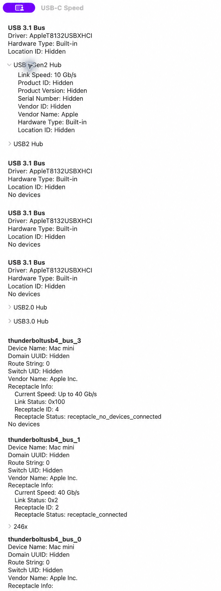

# USB-C Speed

USB-C Speed 是一款 macOS 菜单栏工具，用于查看当前 USB 与 Thunderbolt / USB4 设备的实际连接状态，避免高速设备因线材、扩展坞或接口限制而以较低速率运行。

## 功能

- 显示 USB 设备、集线器及其实际 Link Speed。
- 显示 Thunderbolt / USB4 总线、接口状态和当前可用速率。
- 展开查看设备的厂商、产品、序列号、介质和供电分配等系统信息。
- 设备接入或移除时自动刷新，并发送 macOS 通知。
- 常驻菜单栏，已连接的蓝牙设备会显示电量与充电状态。
- 首次启动后自动注册为登录项，便于持续监测设备连接状态。

## 系统要求

- macOS 26 或更高版本

## 使用

启动应用后，可在主窗口查看完整设备树；点击菜单栏中的闪电图标，可快速查看当前已连接设备。点击设备名称可展开详细信息。

## 网站

访问 [USB-C Speed 官网](https://owenzhao.github.io/USB-C-Speed/) 了解功能、使用方式和项目作者。网站支持跟随系统自动切换明亮与黑暗主题。

## 开发

使用 Xcode 打开 `USB-C Speed.xcodeproj` 后运行即可。

## License

详见 [LICENSE](LICENSE)。
